# Sơ Đồ Hệ Thống Điều Khiển Đèn Giao Thông Thông Minh

Tài liệu này chứa các sơ đồ dưới dạng code có thể chuyển sang hình ảnh UML.
- **Mermaid**: Có thể render trực tiếp trên GitHub, GitLab, Notion, hoặc dùng [Mermaid Live Editor](https://mermaid.live)
- **PlantUML**: Dùng [PlantUML Online](https://www.plantuml.com/plantuml)

---

## 1. Sơ Đồ Kiến Trúc Tổng Quan (System Architecture)

### Mermaid

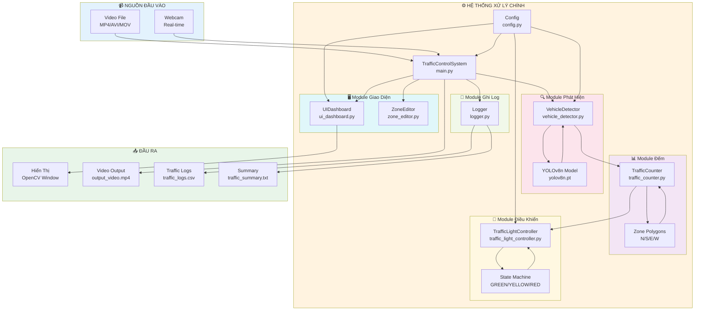

### PlantUML

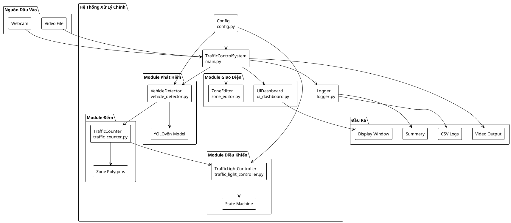

---

## 2. Sơ Đồ Lớp (Class Diagram)

### Mermaid

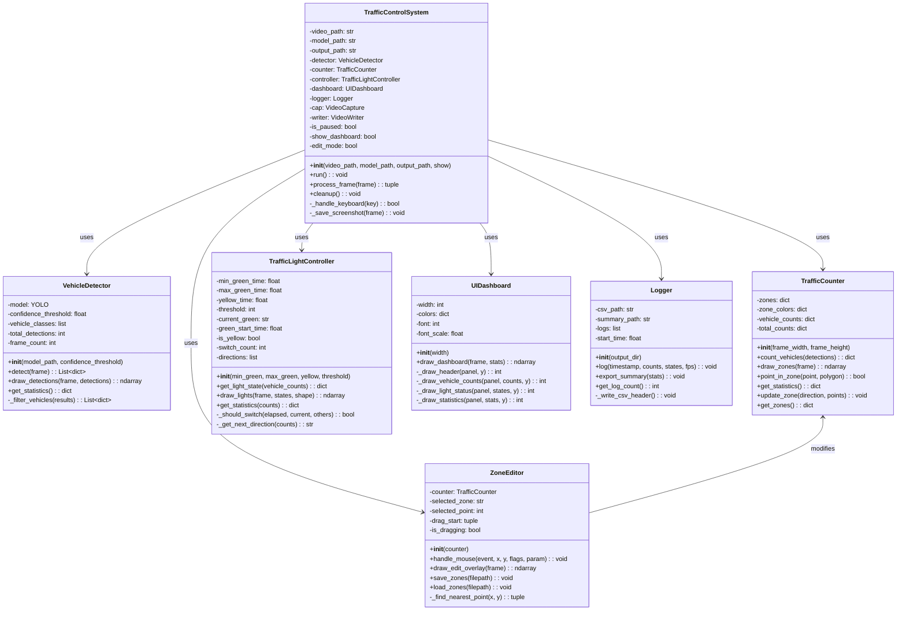

### PlantUML

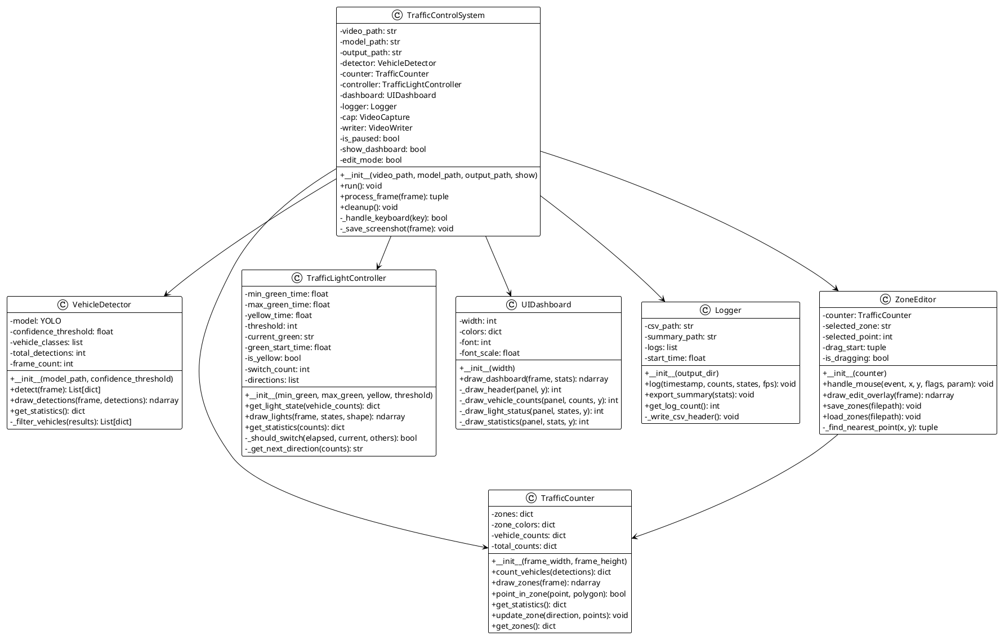

---

## 3. Lưu Đồ Thuật Toán Điều Khiển Đèn Giao Thông

### Mermaid

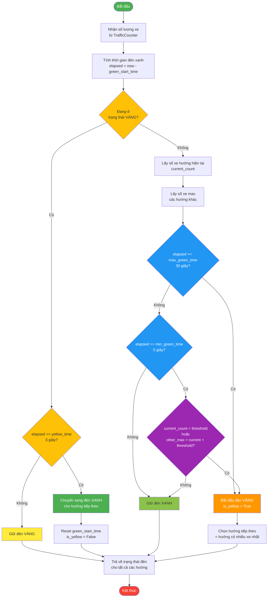

### PlantUML

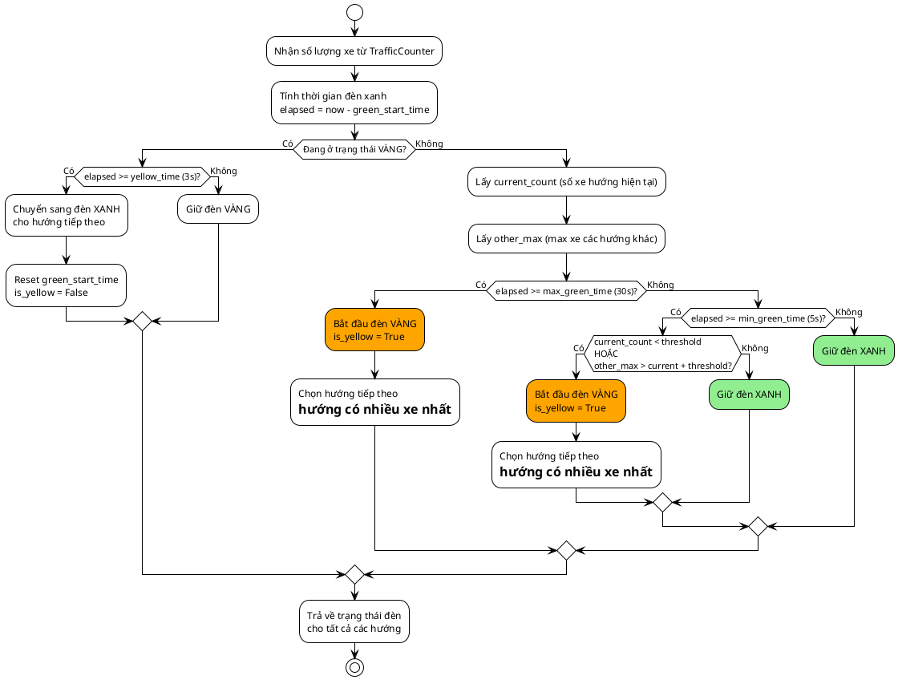

---

## 4. Sơ Đồ Tuần Tự Xử Lý Frame (Sequence Diagram)

### Mermaid

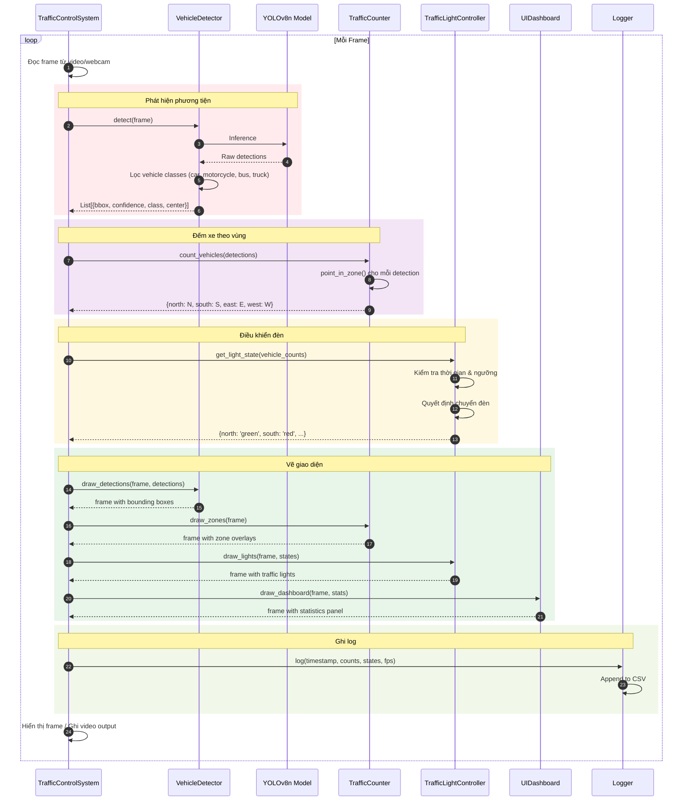

### PlantUML

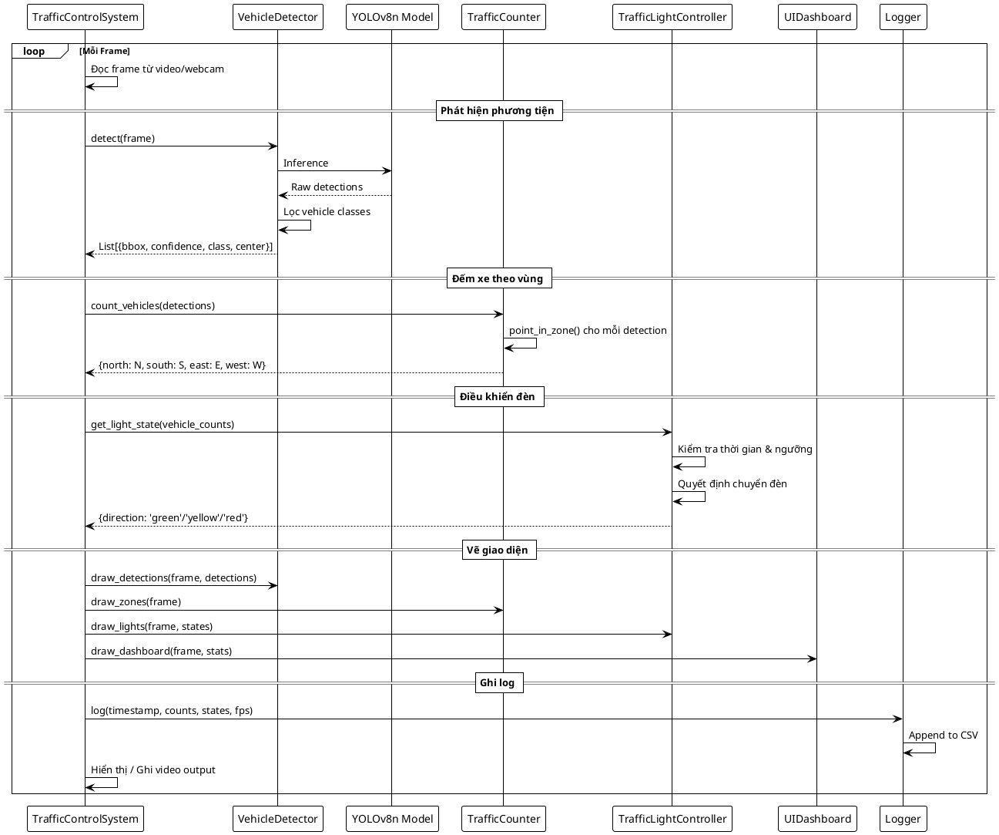

---

## 5. Sơ Đồ Trạng Thái Đèn Giao Thông (State Diagram)

### Mermaid

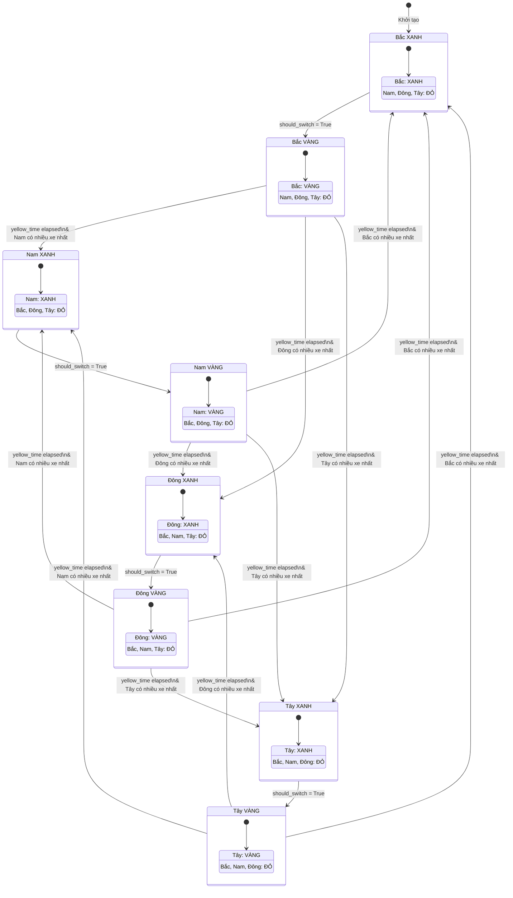

### PlantUML

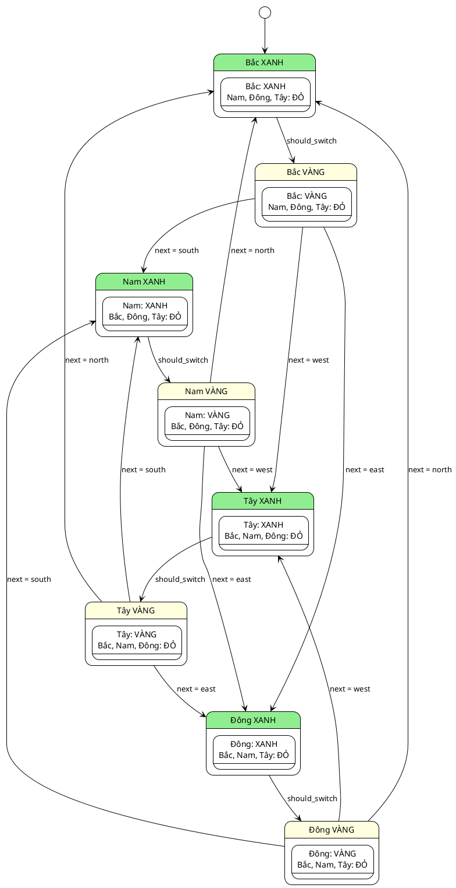

---

## 6. Sơ Đồ Luồng Dữ Liệu (Data Flow Diagram)

### Mermaid

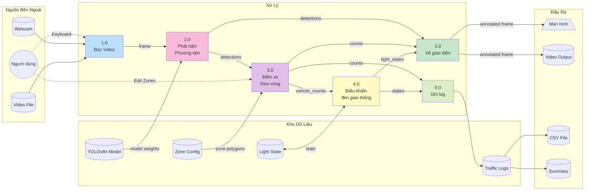

### PlantUML (DFD Style)

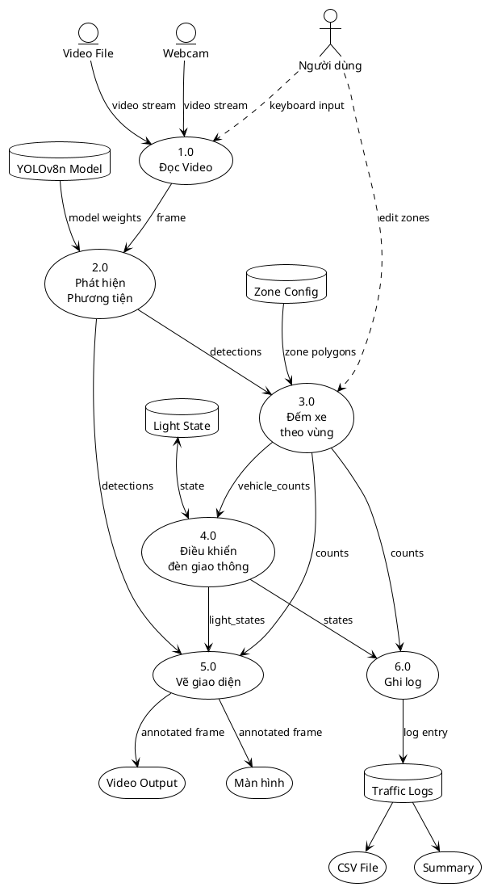

---

## 7. Thuật Toán Ray Casting (Kiểm tra điểm trong đa giác)

### Mermaid

```mermaid
flowchart TD
    START([Bắt đầu]) --> INPUT[/Nhập: point(x,y), polygon[]/]
    INPUT --> INIT[inside = False<br/>n = số đỉnh polygon<br/>p1 = polygon[0]]
    
    INIT --> LOOP{i từ 1 đến n}
    
    LOOP -->|Còn đỉnh| GET_P2[p2 = polygon[i mod n]]
    GET_P2 --> CHECK_Y1{y > min(p1.y, p2.y)?}
    
    CHECK_Y1 -->|Không| NEXT[p1 = p2]
    CHECK_Y1 -->|Có| CHECK_Y2{y <= max(p1.y, p2.y)?}
    
    CHECK_Y2 -->|Không| NEXT
    CHECK_Y2 -->|Có| CHECK_X{x <= max(p1.x, p2.x)?}
    
    CHECK_X -->|Không| NEXT
    CHECK_X -->|Có| CALC_XINTERS[Tính xinters =<br/>(y-p1.y)*(p2.x-p1.x)/(p2.y-p1.y) + p1.x]
    
    CALC_XINTERS --> CHECK_CROSS{p1.x == p2.x<br/>hoặc x <= xinters?}
    
    CHECK_CROSS -->|Có| TOGGLE[inside = NOT inside]
    CHECK_CROSS -->|Không| NEXT
    
    TOGGLE --> NEXT
    NEXT --> LOOP
    
    LOOP -->|Hết đỉnh| RETURN[/Trả về inside/]
    RETURN --> END([Kết thúc])

    style START fill:#4CAF50,color:#fff
    style END fill:#f44336,color:#fff
    style TOGGLE fill:#2196F3,color:#fff
    style CHECK_Y1 fill:#FF9800
    style CHECK_Y2 fill:#FF9800
    style CHECK_X fill:#FF9800
    style CHECK_CROSS fill:#9C27B0,color:#fff
```

---

## 8. Sơ Đồ Component (Component Diagram)

### PlantUML

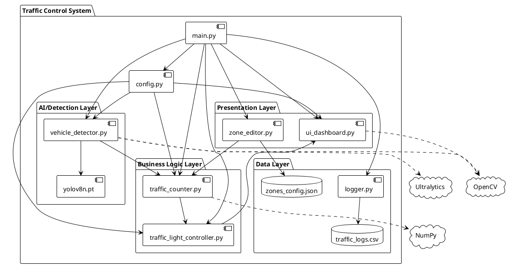

---

## Hướng Dẫn Sử Dụng

### Render Mermaid

1. **GitHub/GitLab**: Đặt code trong block ` ```mermaid ` sẽ tự động render
2. **VS Code**: Cài extension "Markdown Preview Mermaid Support"
3. **Online**: Copy code vào [mermaid.live](https://mermaid.live)

### Render PlantUML

1. **Online**: Copy code vào [plantuml.com/plantuml](https://www.plantuml.com/plantuml)
2. **VS Code**: Cài extension "PlantUML"
3. **IntelliJ/PyCharm**: Cài plugin PlantUML Integration

### Export sang hình ảnh

- Mermaid Live Editor: Export PNG/SVG
- PlantUML: Export PNG/SVG/PDF
- VS Code: Right-click > Export diagram

---

## Tham Khảo Code Gốc

| Sơ đồ | File tham chiếu |
|-------|-----------------|
| Class Diagram | Tất cả file .py |
| Thuật toán điều khiển đèn | `traffic_light_controller.py:41-99` |
| Ray Casting | `traffic_counter.py:61-88` |
| Luồng xử lý frame | `main.py:process_frame()` |
